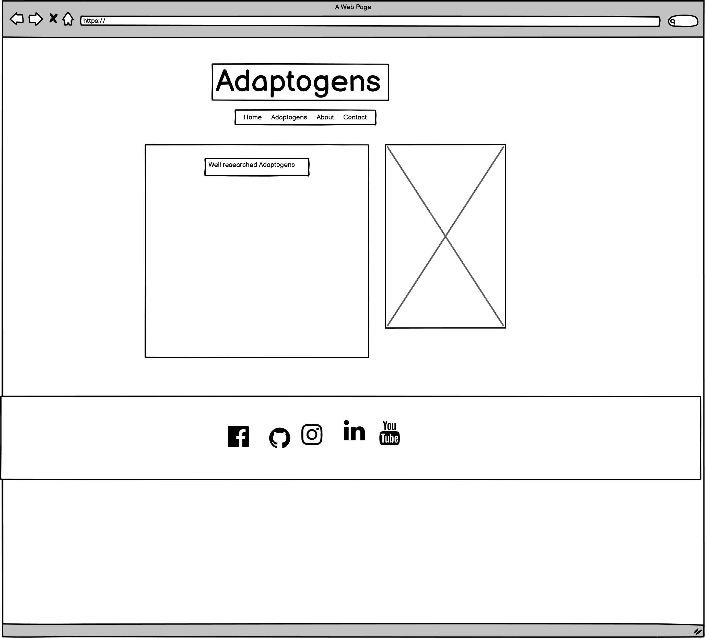
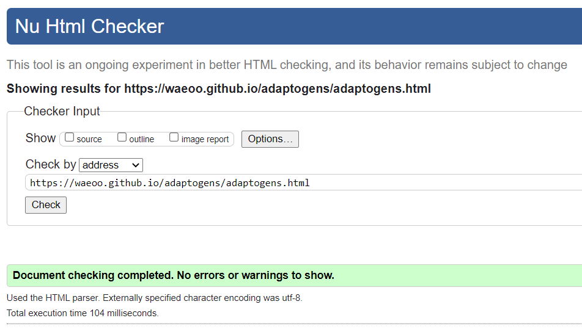
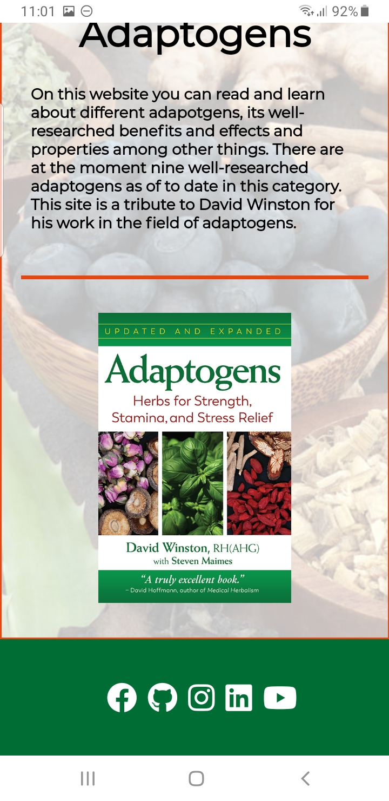

# Adaptogens

- This project was created in hope to provide initial knowledge about adaptogens and enlighten people about its existens, benefits and effects. 

- The site is for anyone interested in learning about the different herbs, plants and maybe spark some further interest to deepen the individuals knowledge about adaptogens.

## User Stories

- As a new visitor visiting the site I want to early know what the site is about and refering to and to quickly discern if it is suitable for what I'm after.

- As a general visitor I want swift navigation and to the parts of releveance. 
Learn and study the information provided and easily find the websites social links.
Be able to contact anyone behind the website.

- As a returning visitor I want to see any updated information and be able to contact anyone behind the website.

## UX

- Design concept was chosen in relation to the Adaptogens book and the sites purpose of being in an informative direction.

### Color Scheme

- Described color scheme for `#e84610`, `#006d35`, `#ffffff`, `red`, `black`.
- Colors used for this project initally stem from the Adaptogens book and also from color tools [Color Tool](https://material.io/) to match eachother.

### Typography

- I choose [Montserrat](https://fonts.google.com/specimen/Montserrat) due to the information purpose font selection.
- For the icons used I choose [FontAwesome](https://fontawesome.com/) for respective footer icon.

### Wireframes

  - [index.html](https://waeoo.github.io/adaptogens/index.html)
  

  - [adaptogens.html](https://waeoo.github.io/adaptogens/adaptogens.html)
  

  - [about.html](https://waeoo.github.io/adaptogens/about.html)
  

  - [contact.html](https://waeoo.github.io/adaptogens/contact.html)
  

## Features

### Existing Features

- __Navigation Bar__

  - Featured on all four pages, the full responsive navigation bar includes links to the Logo and back to home page, adaptogens, about and contact, is identical in each page to allow for easy navigation.
  - This section will allow the user to easily navigate from page to page across all devices without having to revert back to the previous page via the ‘back’ button.

- __The Home page and welcome message__

  - The home page include a welcoming message and a picture of the Adaptogens book.
  - This section introduces the user to show that this site is a reference to the Adaptogens book and the research about adaptogens.

- __The Adaptogens page__

  - The adaptogens page will allow the user to read and learn about the different well-researched adaptogens listed. 
  - The user will find valueable information about the nine different adaptogens listed in order to spark intrest about one or more adaptogens. 

- __The About page__

  - This page inform what the site is about and what categorizes as an adaptogen via the three listed conclusions and what correlates to their usaged profile. 
  - This page will be updated if any adaptogen scope is revised by the scientific research to present an updated approach. 

- __The Footer__ 

  - The footer section includes links to the relevant social media sites for Adaptogens. The links will open to a new tab to allow easy navigation for the user. 
  - The footer is valuable to the user as it encourages them to keep connected via social media and continue learning more about adaptogens.

- __The Contact page__

  - This page will allow the user to send comments or questions about the site, adaptogens and other inquiries. The user will be asked to submit their first name, last name, email address and write their message. 

### Features Left to Implement

Features that is left to implement are:

- Category, probable adaptogens

- Cateogry, possible adaptogens

- History, usage and interactions with the human body

## Testing 

Testing has been performed in browsers such as Chrome, Brave, Firefox and Edge using developer tools to check responsiveness. Review responses have been asked and recieved in relation to different iOS and Android devices. No issues reported. Validator testing and compatibilites are listed below.

### Validator Testing 

- HTML Validation (w3c)

  - [index.html](https://validator.w3.org/nu/?doc=https://waeoo.github.io/adaptogens/index.html)
  - 

  - [adaptogens.html](https://validator.w3.org/nu/?doc=https://waeoo.github.io/adaptogens/adaptogens.html)
  - 

  - [about.html](https://validator.w3.org/nu/?doc=https://waeoo.github.io/adaptogens/about.html)
  - 

  - [contact.html](https://validator.w3.org/nu/?doc=https://waeoo.github.io/adaptogens/contact.html)
  - 

- CSS (w3c)

  - [style.css](https://jigsaw.w3.org/css-validator/validator?uri=https%3A%2F%2Fwaeoo.github.io%2Fadaptogens&profile=css3svg&usermedium=all&warning=1&vextwarning=&lang=en)
  - 

### Fixed Bugs

Random error on contact page that gave error 404.

To fix it I added `.html` to the adaptogens link to contact page.

### Unfixed Bugs

At the moment there are no unfixed bugs discovered. 

### Browser compatibility

- Chrome

- Brave

- Firefox

- Edge

### Responsiveness

- Desktop

- Tablet

- Mobile - Real life phone Samsung Internet on Samsung Galaxy S8+

### Tested User Stories

- As a new visitor:
- At first sight you are presented with the home page feature welcome text, explaining what you can read and learn about. Also a picture of the Adaptogens book as clear reference. Through the presented information you intuitivly you can browse towards the Adaptogens link in the navigation feature in ordet to start learning about the different well-researched adaptogens.

- As a general visitor:
- Coming back to the site you can via the swift navigation feature navigate to for example the Adapotgens page and continue your reading and learning about the different well-researched adaptogens. Even further looking in to the About page feautre explaining what conclusions have been drawn and what defines an adaptogen.
During the browsing and learning and in the event of looking for more content or information you are able to use the social media links feature in the footer section. In case of wanting to start a conversation and asking questions you can also navigate to the Contact page feature and fill out a form with your message.

- As a returning visitor:
- As a returning and perhaps frequent visitor I look for any new messages on the homepage. Check the Adaptogen page for any additional features. After having digested some learning material I have additional questions that needs answers and I navigate to the Contact page to fill out the form and send my message of questions seeking answers.

## Deployment

The site was deployed to GitHub pages. The steps to deploy are as follows:
    * In the [GitHub repository](https://github.com/Waeoo/adaptogens), navigate to the Settings tab.
    * From the Settings tab, scroll down until you see the 'Pages' button on the left.
    * From the Source section drop-down menu, select the `Main` branch.
    * Once the `Main` branch has been selected, the page will be automatically refreshed with a detailed ribbon display to indicate the successful deployment.

The live link can be found here - https://waeoo.github.io/adaptogens

### Local Deployment

To make a local copy of this project, you can clone it by typing the following in your IDE terminal:

- `git clone https://github.com/Waeoo/adaptogens.git`

Alternatively, if using Gitpod, you can click the green Gitpod button, or use [this link](https://gitpod.io/#https://github.com/Waeoo/adaptogens)

## Technology Used

The site Adaptogens was built using HTML5 and CSS3.

## Credits 

### Content 

- Adaptogens information is credited to David Winston and his book Adaptogens.
- Research and code solutions, stackoverflow and w3schools were generally relied upon.
- The icons in the footer were taken from [Font Awesome](https://fontawesome.com/)

### Media

- The background photo used on the site come from [istockphoto](https://www.istockphoto.com/)
- The images used for the adaptogens page come from [istockphoto](https://www.istockphoto.com/) and [pngtree](https://pngtree.com/).
 

### Acknowledgements

- Tim Nelson - Code Institute mentor who explained and guidance supported me effectively and with precision.
- Mr. P - Tester and presenting different approaches and solutions.